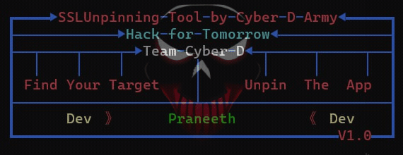

<h1 align="center">&#60;/&#62; SSL pinning &#60;/&#62;</h1>

## Introduction

SSL Unpining is a security measure used in mobile and web applications to enhance SSL/TLS connections. It involves associating a specific SSL certificate or public key with a server, preventing man-in-the-middle attacks. This is achieved by hardcoding the server's certificate within the application, ensuring that only trusted certificates are accepted, thus reducing the risk of unauthorized interception or tampering of communication.

## Disclaimer

**Usage of SSL Unpining for any malicious or unauthorized activities is strictly prohibited.** The developers of SSL Unpining and the Cyber-D team are not responsible for any damage, loss, or misuse of this tool. It is the responsibility of the user to comply with all applicable laws and regulations while using this Tool.

### How to Install

Linux commands.

* `sudo apt update`

* `sudo apt upgrade`

* `sudo apt install python3 git`

* `git clone https://github.com/bytebulliesofficial/SSLBypass`

* `cd SSLBypass`

* `python3 setup.py`

Windows. 
* `Install python and git in ur pc`

* `git clone https://github.com/bytebulliesofficial/SSLBypass`

* `cd SSLBypass`

* `python setup.py`

## Usage
After installing SSL-Unpining, Here’s the basic command to run SSL Unpining:
* `python3 main.py` 

## Legal Notice
SSL Unpining is intended to be used for ethical and legal purposes, such as security testing and educational purposes. Any misuse or illegal use of this tool is not condoned.
The Cyber-D team and the developers of SSL Unpining are not responsible for any illegal, unethical, or unauthorized activities performed by users of this tool.

## Visiter

 
